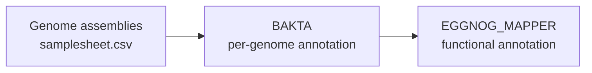

# janus

**janus** is a Nextflow pipeline for bacterial genome annotation using
[Bakta](https://github.com/oschwengers/bakta) with optional functional annotation via
[eggNOG-mapper](https://github.com/eggnogdb/eggnog-mapper).

---

## Overview



---

## Features

- Batch annotation of bacterial genomes via a CSV samplesheet
- Per-sample configuration of genome completeness, Gram stain, and locus tag prefix
- Automatic Bakta database download when no local database is provided
- Optional eggNOG-mapper functional annotation from Bakta protein FASTA outputs
- Automatic eggNOG database download when no local database is provided

---

## Quick start

```bash
nextflow run exterex/janus \
    --input samplesheet.csv \
    --outdir results \
    -profile docker
```

See [Installation](installation.md) and [Usage](usage.md) for full details.
